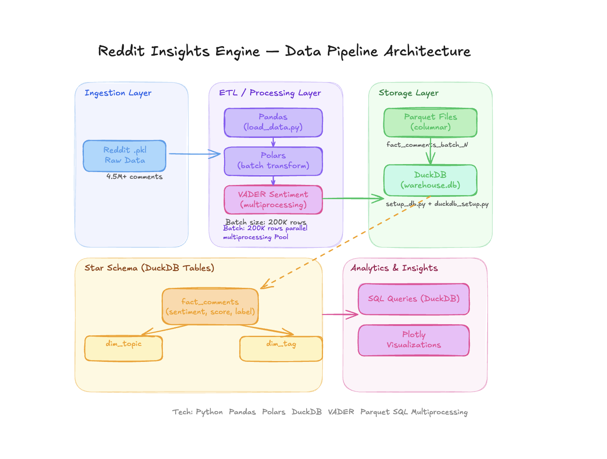

# Reddit Insights Engine: Scalable Data Pipeline & Analytics System

## Overview
This project builds an end-to-end data pipeline to process and analyze large-scale Reddit comment data. It combines data engineering, data warehousing, and machine learning (sentiment analysis) to extract meaningful insights.

## Architecture


<p align="center">
	
</p>


## Tech Stack

- Python
- Pandas
- Polars
- DuckDB
- SQL
- Parquet
- VADER Sentiment Analysis
- Multiprocessing


## Key Features

- Processed **4.5M+ Reddit comments**
- Built a **batch + parallel processing pipeline**
- Implemented **sentiment analysis on text data**
- Designed a **star schema (fact + dimension tables)**
- Optimized storage using **Parquet (columnar format)**
- Enabled fast querying using **DuckDB**


## Example Insights

- Analyzed distribution of Reddit comments into sentiment categories (good, bad, neutral)
- Identified topics with dominant sentiment patterns (positive vs negative discussions)
- Evaluated engagement (comment scores) across different sentiment classes


## Sample Query

```sql
SELECT t.Topic, AVG(f.sentiment_score) AS avg_sentiment
FROM fact_comments_final f
JOIN dim_topic t ON f.topic_id = t.rowid
GROUP BY t.Topic
ORDER BY avg_sentiment DESC;
```

## Future Work
- Integrate real-time streaming data from Reddit API (pending approval)

